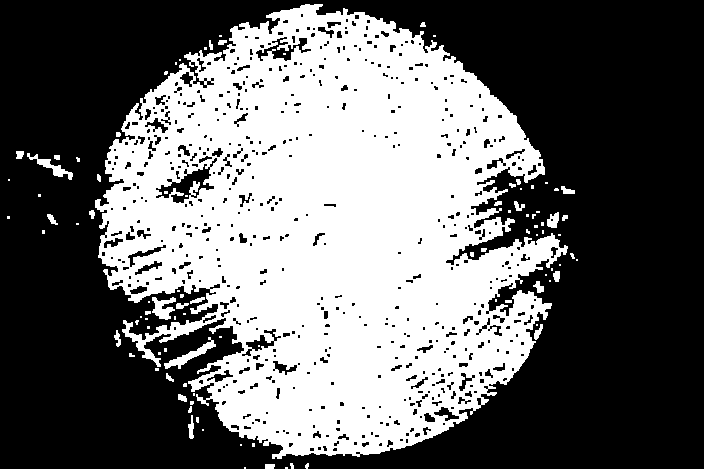
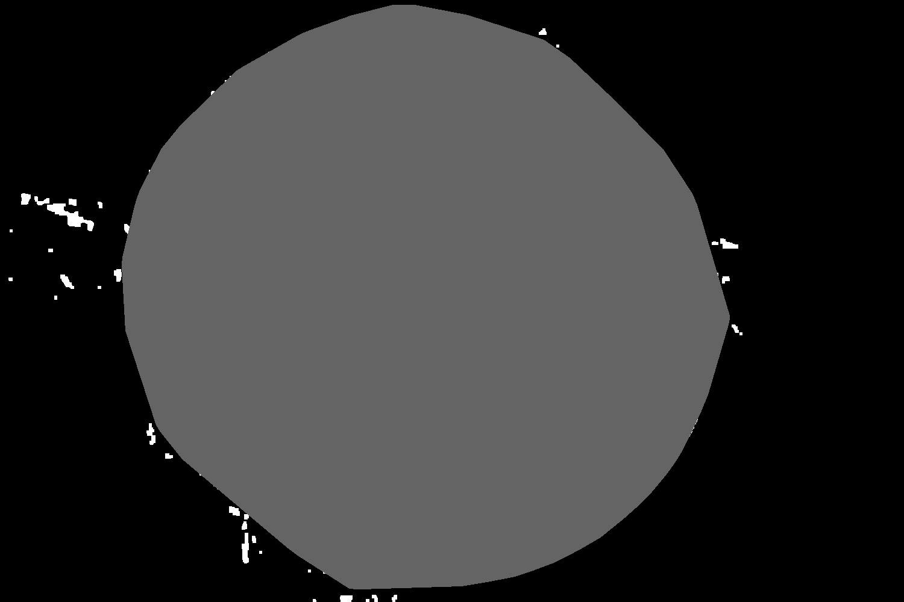
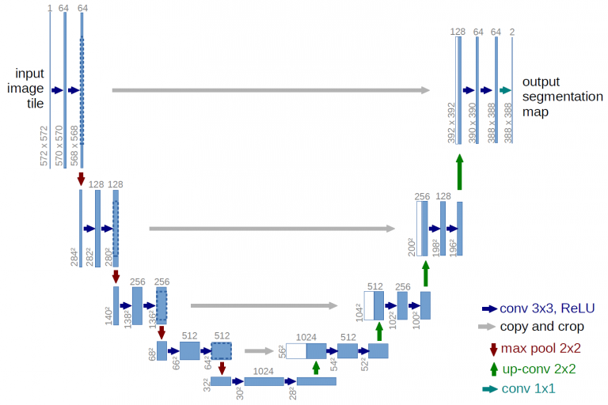

# LogSegmentation

Final project for the Computer Vision class at Automation and Systems Engineering master's degree program.

## Abstract

O objetivo deste trabalho é aplicar técnicas de visão computacional clássica e redes neurais convolucionais na segmentação de madeira em imagens. A segmentação por visão clássica é feita através de uma limiarização no espaço de cor HSV, seguida de operações morfológicas de fechamento, abertura e por fim é aplicado o algoritmo de envoltório convexo. A aplicação da CNN trata de uma segmentação semântica seguindo a estrutura da U-Net em conjunto com o modelo Resnet34. Ambas abordagens apresentaram bons resultados e, por fim, escolheu-se a segmentação semântica da CNN em conjunto com um pós processamento envolvendo os algoritmos clássicos de visão.

## Metodologia

A primeira forma de resolver esse problema é através das técnicas disponíveis na visão computacional clássica. O método aqui empregado faz inicialmente uma limiarização no espaço de cor HSV, buscando filtrar da melhor forma possível os pixels que possuem tons parecidos com o da madeira. É natural que esse tipo de abordagem deixe ruídos na imagem, que aqui são tratados através de operações morfológicas de fechamento e abertura, respectivamente. A figura à seguir mostra o resultado das operações morfológicas.

Na sequência basta realizar a análise de componentes conexos, selecionar o maior elemento presente na imagem e, então, aplicar um algoritmo de geração de envoltório convexo para reconstruir o formado da madeira. Perceba que essa sequência de processamento funciona bem para toras de madeira cuja face tem formato próximo de uma elipse. O resultado deve ser parecido com aquele visto na figura seguinte.

A segunda forma de resolver o problema da segmentação é através do uso de uma CNN. A arquitetura de CNN escolhida para esse trabalho é a da U-Net, utilizando-se do modelo Resnet34. O uso de ambos os elementos em conjunto permite realizar a segmentação de objetos em imagens. A figura abaixo apresenta um modelo de U-Net.

Os resultados, discussões, conclusão e maiores detalhes podem ser encontrados no PDF 'Poster_INE' no repositório.

[⬆ Voltar ao topo](#nome-do-projeto) 
